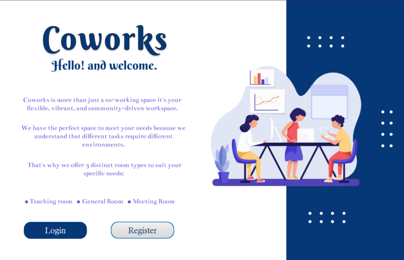

# Coworks - Coworking Space System


## Overview

Coworks is an Object-Oriented Programming (OOP) project developed by Team 53 at  [Faculty of Computer and Information Science - ASU](https://cis.asu.edu.eg/)
. It is a system designed to manage a coworking space, facilitating the reservation and administration of various room types for different users.

## Welcome Screen



## Features

- **Room Types:**
  - General Room
  - Meeting Room
  - Teaching Room

- **User Types:**
  - Visitor
  - Administrator

- **Technologies Used:**
  - Java (OOP)
  - JavaFX for GUI
  - Maven for Dependency Management
  - JSON for Data Serialization

## System Architecture

The system is built on OOP principles, providing flexibility and modularity in managing different room types and user roles. JavaFX is used for the graphical user interface, creating an intuitive and user-friendly experience.

## How to Run

1. Clone the repository:
   ```bash
   git clone https://github.com/your-username/coworks.git
2. Build the project using Maven:
    ```bash
    mvn clean install
3. Run the application:
   ```bash
   java -jar target/coworks.jar
